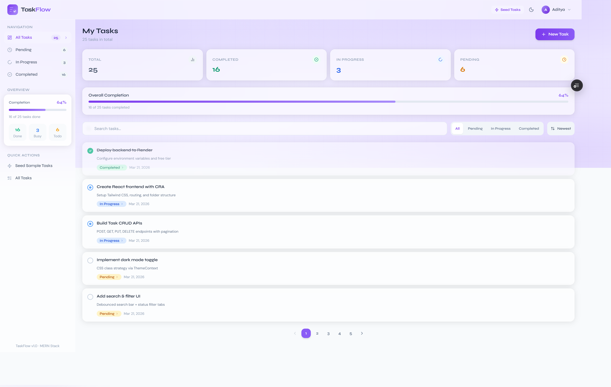
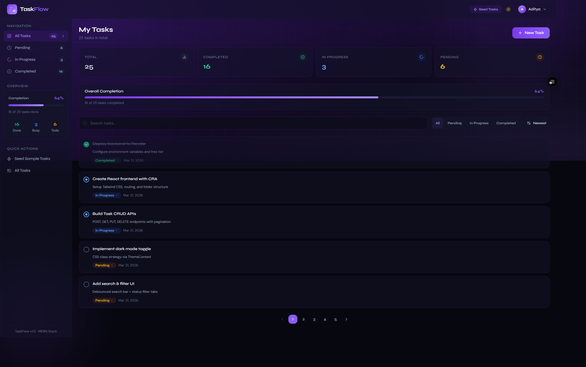
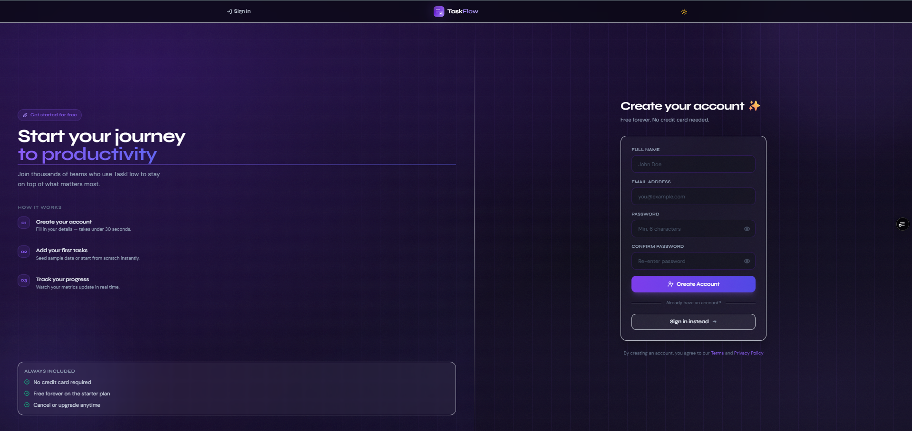
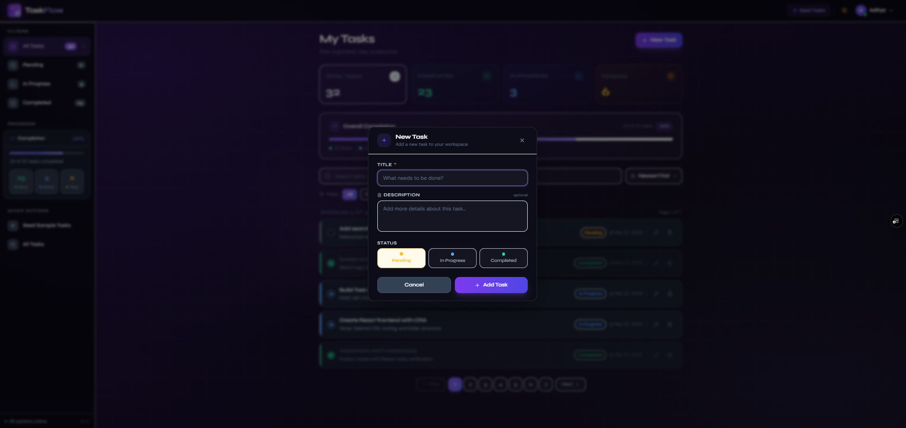
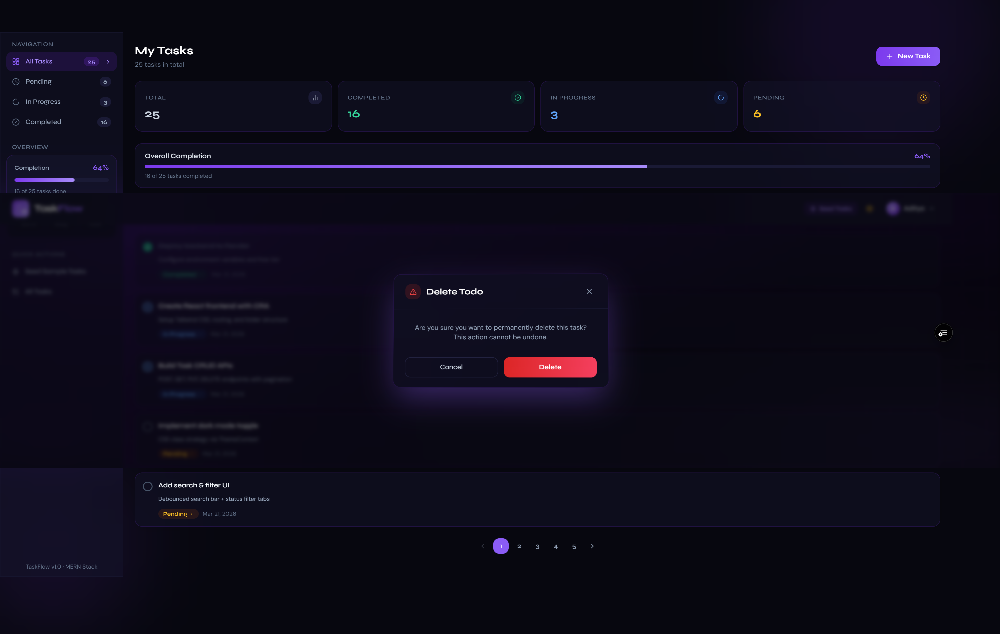
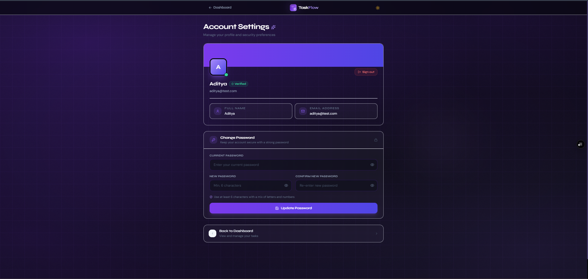
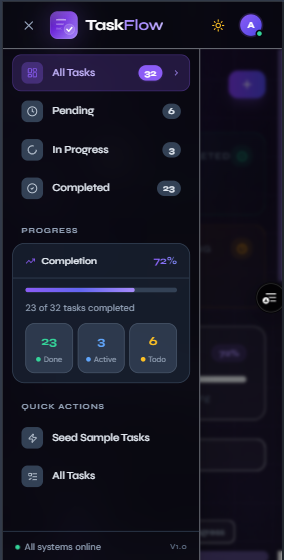

<div align="center">

# 📝 TaskFlow

### *Your tasks. Your flow. Totally under control.*

<br/>

[](https://react.dev/)
[](https://nodejs.org/)
[](https://expressjs.com/)
[](https://www.mongodb.com/)
[](https://tailwindcss.com/)
[](https://jwt.io/)
[](https://opensource.org/licenses/ISC)

<br/>

[](https://todo-frontend-swart-nine.vercel.app/)
[](https://todo-backend-t5gm.onrender.com/)
[](https://www.loom.com/share/cf2456f629684cfeaec0441862e4416d)
[](https://github.com/aditya32193213)

<br/>

> 🚀 A **production-ready, full-stack MERN** Todo application with JWT authentication, dark mode, real-time task metrics, debounced search, server-side pagination, token blacklisting, and a glassmorphism UI — engineered with clean layered architecture across the entire stack.

<br/>

| 🌐 Live Frontend | ⚙️ Live Backend API |
|:---:|:---:|
| [todo-frontend-swart-nine.vercel.app](https://todo-frontend-swart-nine.vercel.app/) | [todo-backend-t5gm.onrender.com](https://todo-backend-t5gm.onrender.com/) |
| Deployed on **Vercel** | Deployed on **Render** |

</div>

---

## 📌 Table of Contents

- [🎬 Demo](#-demo)
- [📸 Screenshots](#-screenshots)
- [✨ Key Features](#-key-features)
- [🛠️ Full Tech Stack](#️-full-tech-stack)
- [📁 Monorepo Structure](#-monorepo-structure)
- [🏗️ System Architecture](#️-system-architecture)
- [🖥️ Frontend](#️-frontend)
- [📂 Frontend Folder Overview](#-frontend-folder-overview)
- [🪝 Hooks Architecture](#-hooks-architecture)
- [🧩 Component Reference](#-component-reference)
- [🌐 API Integration](#-api-integration)
- [⚙️ Backend](#️-backend)
- [📂 Backend Folder Overview](#-backend-folder-overview)
- [🔐 Auth Endpoints](#-auth-endpoints)
- [✅ Task Endpoints](#-task-endpoints)
- [⚠️ Error Handling](#️-error-handling)
- [🗄️ Database Design](#️-database-design)
- [🔒 Security Architecture](#-security-architecture)
- [🌿 Environment Variables](#-environment-variables)
- [🚀 Setup and Installation](#-setup-and-installation)
- [🎨 Theming and Styling](#-theming-and-styling)
- [⚡ Performance Optimisations](#-performance-optimisations)
- [♿ Accessibility](#-accessibility)
- [🧠 Architecture and Design Decisions](#-architecture-and-design-decisions)
- [🔮 Future Enhancements](#-future-enhancements)
- [👤 Author](#-author)

---

## 🎬 Demo

<div align="center">

[](https://www.loom.com/share/cf2456f629684cfeaec0441862e4416d)

*Click above to watch a complete walkthrough of TaskFlow in action!*

</div>

---

## 📸 Screenshots


<div align="center">

### 🏠 Dashboard — Light Mode


### 🌙 Dashboard — Dark Mode


### 🔐 Login Page


### 📝 Register Page


### ✅ Create / Edit Task Modal


### 🗑️ Delete Confirmation Modal


### 👤 Profile Page


### 📱 Mobile — Sidebar Overlay


</div>

---

## ✨ Key Features

### 🔐 Authentication and Security
- JWT-based register, login, and logout with **server-side token blacklisting**
- Client-side JWT expiry check in `PrivateRoute` — redirects *before* the first API call fires
- Two isolated loading states (`authLoading` vs `profileLoading`) — no spinner cross-contamination
- `select: false` on the password field — hash **never** leaks into any API response
- Two-tier rate limiting: 200 req/15min globally, 20 req/15min on auth routes
- Helmet (~15 HTTP security headers), strict CORS, 10 kb JSON body cap

### ✅ Task Management
- Full **CRUD** — create, read, update, delete
- **Optimistic status updates** with automatic rollback on API failure
- One-click status cycling: `pending → in-progress → completed → pending`
- Smooth **exit animation** (220ms) before DOM removal on delete
- 8-task seed for instant onboarding via parallel `Promise.all`

### 🔍 Search, Filter and Sort
- **Debounced search** (400ms) — zero API calls while typing; regex-escaped (ReDoS safe)
- Status filter tabs: All / Pending / In Progress / Completed
- Sort: Newest / Oldest / A-Z / Z-A
- All filter/sort/search changes **automatically reset to page 1**
- Empty-state differentiation: "No tasks yet" vs "No results found"

### 📊 Metrics and Progress
- Real-time stat cards: Total · Completed · In Progress · Pending
- Animated completion percentage progress bar
- All counts in **one MongoDB `$facet` aggregation** — single DB round-trip
- Non-critical: metrics failure never crashes the page

### 🎨 UI and Theming
- **Dark / Light mode** — persisted in `localStorage`, follows OS `prefers-color-scheme` in real time
- Glassmorphism design: `glass-card`, `page-bg`, `grid-overlay`, animated `orb` backgrounds
- Animated gradient logo with per-instance unique SVG gradient IDs (via `useId`)
- Fully responsive: mobile sidebar overlay + static desktop sidebar

---

## 🛠️ Full Tech Stack

### 🖥️ Frontend

| Category | Technology | Version | Purpose |
|---|---|---|---|
| ⚛️ UI Library | **React** | ^19.2.4 | Component model and rendering |
| 🎨 Styling | **Tailwind CSS** | ^3.4.19 | Utility-first CSS |
| 🗺️ Routing | **React Router DOM** | ^7.13.1 | Client-side routing and protected routes |
| 🌐 HTTP | **Axios** | ^1.13.6 | API calls with request/response interceptors |
| 🔔 Toasts | **react-hot-toast** | ^2.6.0 | Non-blocking notifications |
| 🎯 Icons | **lucide-react** | ^0.577.0 | Stroke icon library |
| 🔲 Icons | **react-icons** | ^5.6.0 | Additional icon sets |
| 🧪 Testing | **@testing-library/react** | ^16.3.2 | Component testing utilities |
| 📦 Build | **react-scripts (CRA)** | 5.0.1 | Build toolchain |
| 🔧 CSS | **autoprefixer + postcss** | latest | Vendor prefix automation |

### ⚙️ Backend

| Category | Technology | Version | Purpose |
|---|---|---|---|
| ⚙️ Runtime | **Node.js** (ESM) | >= 18 | Server runtime |
| 🚂 Framework | **Express** | ^5.2.1 | HTTP routing and middleware |
| 🍃 Database | **MongoDB** via **Mongoose** | ^9.3.1 | Document storage and ORM |
| 🔑 Auth | **jsonwebtoken** | ^9.0.3 | JWT signing and verification |
| 🔐 Hashing | **bcryptjs** | ^3.0.3 | Password hashing (salt rounds: 10) |
| 🛡️ Security | **helmet** | ^8.1.0 | HTTP security headers |
| 🌐 CORS | **cors** | ^2.8.6 | Cross-origin request control |
| 🚦 Rate Limit | **express-rate-limit** | ^8.3.1 | Brute-force and DDoS protection |
| 🔐 Env | **dotenv** | ^17.3.1 | Environment variable loading |
| 🔄 Dev | **nodemon** | ^3.1.14 | Hot-reload development server |

---

## 📁 Monorepo Structure

```
taskflow/
│
├── 📄 README.md                            ← This file
├── 📄 .gitignore
│
├── 📂 client/                              ← 🖥️  React Frontend (CRA + Tailwind)
│   ├── 📄 package.json
│   ├── 📄 tailwind.config.js
│   ├── 📄 postcss.config.js
│   ├── 📄 .env.example
│   └── 📂 src/
│       ├── 📄 App.jsx                      # Root: providers, router, routes, Toaster
│       ├── 📂 pages/
│       │   ├── 📄 Home.jsx                 # Dashboard: tasks, metrics, search, pagination
│       │   ├── 📄 Login.jsx                # Sign-in form
│       │   ├── 📄 Register.jsx             # Registration form
│       │   └── 📄 Profile.jsx              # User info + change password
│       ├── 📂 components/
│       │   ├── 📄 ErrorBoundary.jsx        # Class error boundary + dev stack overlay
│       │   ├── 📄 FormField.jsx            # Accessible label + input + error wrapper
│       │   ├── 📄 Logo.jsx                 # Animated gradient TaskFlow logo
│       │   ├── 📄 Navbar.jsx               # Sticky top bar with user dropdown (memo)
│       │   ├── 📄 PageBackground.jsx       # Orb + grid overlay backgrounds (memo)
│       │   ├── 📄 PasswordInput.jsx        # Unified show/hide password field
│       │   ├── 📄 PrivateRoute.jsx         # JWT expiry guard for protected pages
│       │   ├── 📄 Sidebar.jsx              # Collapsible nav + filters + metrics (memo)
│       │   ├── 📄 TodoCard.jsx             # Task row: toggle, edit, delete (memo)
│       │   └── 📄 TodoModal.jsx            # Create / Edit / Delete modal dialog
│       ├── 📂 context/
│       │   ├── 📄 AuthContext.jsx          # Auth state: user, login, logout, password
│       │   └── 📄 ThemeContext.jsx         # Dark/light mode + OS sync
│       ├── 📂 hooks/
│       │   ├── 📄 useTasks.js              # Orchestrator — composes all sub-hooks
│       │   ├── 📄 useTaskList.js           # Fetch + pagination + search + filter + sort
│       │   ├── 📄 useTaskMetrics.js        # Isolated metrics fetch (non-critical)
│       │   ├── 📄 useTaskModal.js          # Modal open/close/mode/formData (pure UI)
│       │   ├── 📄 useTaskMutations.js      # All writes + seed + optimistic toggle
│       │   ├── 📄 useAuth.js               # Re-export shim -> AuthContext
│       │   └── 📄 useDebounce.js           # 400ms debounce for search input
│       ├── 📂 services/
│       │   ├── 📄 api.js                   # Axios instance + interceptors
│       │   ├── 📄 authService.js           # Auth API calls
│       │   └── 📄 todoService.js           # Task API calls
│       └── 📂 features/tasks/
│           ├── 📄 taskConstants.js         # STATUS_MAP, STATUSES, NAV_ITEMS, labels
│           └── 📄 seedTasks.js             # 8 sample tasks for onboarding
│
└── 📂 server/                              ← ⚙️  Express Backend (Node.js ESM)
    ├── 📄 package.json
    ├── 📄 server.js                        # Entry: env validation + server bootstrap
    ├── 📄 app.js                           # Express app: middleware stack + routes
    ├── 📄 .env.example
    ├── 📂 config/
    │   └── 📄 db.js                        # MongoDB connection (pool min:2 max:10)
    ├── 📂 routes/
    │   ├── 📄 index.js                     # Root router: mounts /auth + /tasks
    │   ├── 📄 auth.route.js                # Auth endpoint definitions
    │   └── 📄 task.route.js                # Task endpoint definitions
    ├── 📂 controllers/
    │   ├── 📄 auth.controller.js           # Input validation + service delegation
    │   └── 📄 task.controller.js           # Input validation + service delegation
    ├── 📂 services/
    │   ├── 📄 auth.service.js              # register/login/logout/updatePassword
    │   └── 📄 task.service.js              # getAllTasks/metrics/CRUD
    ├── 📂 models/
    │   ├── 📄 user.model.js                # User schema (password: select:false)
    │   ├── 📄 task.model.js                # Task schema + 3 compound indexes
    │   └── 📄 tokenBlacklist.model.js      # Blacklisted JWTs with TTL auto-expiry
    ├── 📂 middleware/
    │   ├── 📄 auth.middleware.js           # JWT verify -> blacklist -> user lookup
    │   └── 📄 error.middleware.js          # Centralised global error handler
    └── 📂 utils/
        └── 📄 generateToken.js             # JWT signing utility
```

---

## 🏗️ System Architecture

```
┌─────────────────────────────────────────────────────────────────────────────┐
│                       BROWSER — React Frontend                              │
│               https://todo-frontend-swart-nine.vercel.app                   │
│                                                                             │
│  App.jsx — Provider tree                                                    │
│  ┌───────────────────────────────────────────────────────────────────────┐  │
│  │ <ThemeProvider>  isDark, toggle()                                     │  │
│  │   <AuthProvider>  user, authLoading, profileLoading                   │  │
│  │     <BrowserRouter>                                                   │  │
│  │       <RouteErrorBoundary> (ErrorBoundary + useNavigate wrapper)      │  │
│  │         <Suspense fallback={<PageLoader />}>                          │  │
│  │           /         -> PrivateRoute -> Home     (lazy chunk)          │  │
│  │           /profile  -> PrivateRoute -> Profile  (lazy chunk)          │  │
│  │           /login    ->               Login      (lazy chunk)          │  │
│  │           /register ->               Register   (lazy chunk)          │  │
│  │           *         -> inline 404                                     │  │
│  └───────────────────────────────────────────────────────────────────────┘  │
│  <Toaster /> outside BrowserRouter — survives route transitions             │
│                                                                             │
│  Home.jsx — useTasks() composition                                          │
│  ┌─────────────┐  ┌────────────────────────────────┐  ┌─────────────────┐  │
│  │  Navbar     │  │  <main>                        │  │   Sidebar       │  │
│  │  (memo)     │  │  Metric cards  (memoized x4)   │  │   (memo)        │  │
│  │  Seed btn   │  │  Progress bar                  │  │  Filter tabs    │  │
│  │  Theme btn  │  │  Search + Filter + Sort        │  │  Progress mini  │  │
│  │  User menu  │  │  TodoCard list  (memo x n)     │  │  Quick actions  │  │
│  └─────────────┘  │  Pagination  (memoized)        │  └─────────────────┘  │
│                   └────────────────────────────────┘                        │
│  <TodoModal />  (create | edit | delete)                                    │
│                                                                             │
│  services/api.js — Axios instance                                           │
│  Request  interceptor: Authorization: Bearer <token>                        │
│  Response interceptor: 401 -> clear storage -> toast -> /login              │
│                         (skipped when isLoggingOut = true)                  │
└───────────────────────────────┬─────────────────────────────────────────────┘
                                │  HTTPS
                                ▼
┌─────────────────────────────────────────────────────────────────────────────┐
│                   EXPRESS BACKEND — Render                                  │
│               https://todo-backend-t5gm.onrender.com                        │
│                                                                             │
│  app.js — Middleware stack                                                  │
│  Helmet -> CORS -> Body Parser (10kb) -> Rate Limiter -> Router             │
│                                                                             │
│  /api/auth/*  (+ authLimiter 20/15min)                                      │
│  /api/tasks/* (+ protect middleware)                                        │
│                                                                             │
│  auth.middleware.js (protect)                                               │
│   1. jwt.verify()           CPU only — expired/invalid stopped here        │
│   2. TokenBlacklist.exists() DB query — logged-out tokens stopped here     │
│   3. User.findById()         DB query — deleted accounts stopped here      │
│                                                                             │
│  Controller -> Service -> Mongoose -> MongoDB                               │
│                                                                             │
│  MongoDB Atlas                                                              │
│  User (password:select:false)  Task (3 compound indexes)  TokenBlacklist   │
│  Pool: min 2, max 10           $facet aggregation          TTL index        │
│                                                                             │
│  error.middleware.js (global — catches everything)                          │
└─────────────────────────────────────────────────────────────────────────────┘
```

### 🔄 Request Lifecycle

```
Request
 -> Helmet (security headers)
 -> CORS (strict origin check)
 -> Body Parser (JSON, 10kb cap)
 -> Rate Limiter (global 200/15min + auth 20/15min)
 -> Router (match route)
 -> auth.middleware (JWT verify -> blacklist -> user)
 -> Controller (validate inputs)
 -> Service (business logic)
 -> Mongoose -> MongoDB
 -> JSON Response  OR  next(error) -> error.middleware -> Response
```

### 🔄 Full Data Flow — Create Task Example

```
User clicks "Add Task" in TodoModal
 -> TodoModal.onSave()
 -> useTaskMutations.handleSave()
    isSaving.current = true      (ref: no re-render, blocks double-submit)
    setIsMutating(true)          (state: triggers button spinner)
    todoService.createTodo(formData)
      -> api.js POST /api/tasks  (Bearer token auto-attached)
         -> auth.middleware verifies token
         -> task.controller validates input
         -> task.service.createTaskService()
         -> Task.create({ title, description, status, userId })
         -> { success: true, data: task }
    fetchTodos()                 (refresh list + pagination counts)
    fetchMetrics()               (refresh stat cards)
    toast.success("Task created!")
    closeModal()
 finally: isSaving.current = false, setIsMutating(false)
```

---

## 🖥️ Frontend

### 📂 Frontend Folder Overview

#### Pages

All pages are **lazy-loaded** — JS chunks download on first visit only.

| Page | Route | Protected | Description |
|---|---|---|---|
| `Home.jsx` | `/` | Yes | Dashboard: task list, metrics, search, filter, sort, pagination |
| `Login.jsx` | `/login` | No | Email + password sign-in |
| `Register.jsx` | `/register` | No | Account creation with confirm password |
| `Profile.jsx` | `/profile` | Yes | Read-only user info + change password form |

#### Components

| Component | Memoised | Key Details |
|---|---|---|
| `ErrorBoundary` | Yes (class) | `onReset` soft-nav; dev overlay with `componentStack`; Sentry-ready |
| `FormField` | No | `useId()` + `cloneElement`; `role="alert"` on errors |
| `Logo` | No | Per-instance SVG gradient IDs via `useId()` |
| `Navbar` | Yes | Sticky; hamburger; theme toggle; Escape handler on dropdown |
| `PageBackground` | Yes | Module-level orb arrays -> stable refs -> memo fires reliably |
| `PasswordInput` | No | Replaces 3 duplicate implementations; spreads `...rest` for ID compat |
| `PrivateRoute` | No | `atob` JWT decode; redirects before any API call fires |
| `Sidebar` | Yes | Mobile overlay + backdrop-blur; count badges from constants |
| `TodoCard` | Yes | Status circle toggle; hover-reveal actions; `useMemo` date; exit animation |
| `TodoModal` | No | `aria-labelledby`; auto-focus; Escape key; `isMutating` spinner; 3 modes |

#### Context

| Context | State Held | Key Behaviour |
|---|---|---|
| `AuthContext` | `user`, `authLoading`, `profileLoading` | Two isolated spinners; `isLoggingOut` coordination with Axios 401 interceptor |
| `ThemeContext` | `isDark` | Real-time OS media query listener; manual toggle persisted; memoized value |

---

### 🪝 Hooks Architecture

```
Home.jsx
  └── useTasks()                     single import, flat API
        ├── useTaskList               fetch + pagination (5/page) + search + filter + sort
        │     └── useDebounce         400ms delay on search string
        ├── useTaskMetrics            GET /tasks/metrics — isolated, silent on failure
        ├── useTaskModal              pure UI state: open/close/mode/formData
        └── useTaskMutations          all writes + seed + optimistic status toggle
```

#### Guard Patterns

| Pattern | Hook | Purpose |
|---|---|---|
| `isSaving` ref | `useTaskMutations` | Double-submit guard — no extra re-render |
| `isMutating` state | `useTaskMutations` | Drives Save button spinner |
| 400ms debounce | `useTaskList` + `useDebounce` | Gates API until typing pauses |
| `setPage(1)` on filters | `useTaskList` | Never shows stale page after filter change |
| Silent metrics fail | `useTaskMetrics` | Non-critical — never crashes the page |
| Optimistic + rollback | `useTaskMutations` | Instant UI; silent revert on error |
| 220ms delete delay | `useTaskMutations` | Animation runs before DOM removal |

---

### 🧩 Component Reference

#### `<TodoCard />`
- Status circle: empty border (pending) -> pulsing dot (in-progress) -> checkmark (completed)
- Hover-reveal edit/delete buttons (opacity: 0 -> 100 on group-hover)
- `try/finally` on toggle — `toggling` always resets even on network error
- `useMemo` on date format — `new Date()` only runs when `createdAt` changes
- `task-exit` CSS class triggers smooth slide+fade deletion animation

#### `<TodoModal />`
- `role="dialog"` + `aria-modal="true"` + `aria-labelledby="modal-dialog-title"`
- Auto-focuses title input 80ms after open (Suspense-safe delay)
- Global `Escape` key listener with proper cleanup on close
- Inline title validation on blur — red ring before submit attempt
- Status pills: amber (pending) / blue (in-progress) / emerald (completed)
- `isMutating` disables both buttons + shows animated spinner text

#### `<FormField />`
- `useId()` generates a stable unique ID per instance (SSR-safe)
- `cloneElement` injects that ID onto the single child element
- `htmlFor` -> clicking the label text focuses the input
- `role="alert"` on error paragraph for immediate screen-reader announcement

#### `<PrivateRoute />`
Fails and redirects to `/login` if any of these are true:
1. `user` context is null
2. No `token` in `localStorage`
3. `Date.now() >= exp * 1000` (decoded via `atob` — signature check is the server's job)

---

### 🌐 API Integration

**Axios Instance** (`client/src/services/api.js`):

| Setting | Value |
|---|---|
| `baseURL` | `REACT_APP_API_URL` env var (falls back to Render URL) |
| `timeout` | 12 000ms |
| Dev warning | `console.warn` fires if `REACT_APP_API_URL` is unset |

**Interceptors:**
- **Request**: auto-attaches `Authorization: Bearer <token>` from localStorage
- **Response 401**: clears localStorage -> `toast.error` -> redirects to `/login` after 1.5s; skipped when `isLoggingOut = true`

**Backend response shape** — all endpoints:
```json
{ "success": true, "message": "...", "data": <payload> }
```
`todoService` reads `res.data.data` to unwrap the payload.

#### Service Functions

| Function | Method | Endpoint | Returns |
|---|---|---|---|
| `login(data)` | POST | `/auth/login` | `{id, name, email, token}` |
| `register(data)` | POST | `/auth/register` | `{id, name, email, token}` |
| `logout(token)` | POST | `/auth/logout` | `200 OK` |
| `updatePassword(data)` | PATCH | `/auth/password` | `200 OK` |
| `getTodos(params)` | GET | `/tasks` | `{tasks, total, page, pages, count}` |
| `getTaskMetrics()` | GET | `/tasks/metrics` | `{total, completed, inProgress, pending, pct}` |
| `createTodo(data)` | POST | `/tasks` | task object |
| `updateTodo(id, data)` | PUT | `/tasks/:id` | updated task object |
| `deleteTodo(id)` | DELETE | `/tasks/:id` | `204 No Content` |

---

## ⚙️ Backend

### 📂 Backend Folder Overview

```
HTTP Request
  -> Routes      (define method + path, apply middleware)
  -> Controller  (validate inputs, call service)
  -> Service     (business logic, DB queries)
  -> Model       (Mongoose schema + indexes)
  -> MongoDB
```

| Layer | Files | Responsibility |
|---|---|---|
| 🗺️ Routes | `auth.route.js`, `task.route.js`, `index.js` | Define endpoints, apply rate limiter and protect middleware |
| 🎮 Controllers | `auth.controller.js`, `task.controller.js` | Input validation, delegate to service |
| 🧠 Services | `auth.service.js`, `task.service.js` | All business logic and DB queries |
| 📋 Models | `user.model.js`, `task.model.js`, `tokenBlacklist.model.js` | Schemas, indexes, TTL |
| 🛡️ Middleware | `auth.middleware.js`, `error.middleware.js` | Auth guard, global error handler |
| 🔑 Utils | `generateToken.js` | JWT signing |

---

### 🔐 Auth Endpoints

> All auth routes carry the **authLimiter** (20 req / 15 min / IP).
> Routes marked with 🔒 require `Authorization: Bearer <token>`.

#### 📝 Register
```http
POST /api/auth/register
```
```json
{ "name": "Aditya", "email": "aditya@example.com", "password": "secret123" }
```
**Response `201 Created`**
```json
{
  "success": true,
  "message": "User registered successfully",
  "data": { "id": "665f...", "name": "Aditya", "email": "aditya@example.com", "token": "eyJ..." }
}
```

| Condition | Status | Message |
|---|---|---|
| Missing / blank field | `400` | `"All fields are required"` |
| Invalid email format | `400` | `"Invalid email format"` |
| Password < 6 characters | `400` | `"Password must be at least 6 characters"` |
| Email already registered | `409` | `"User already exists"` |

---

#### 🔓 Login
```http
POST /api/auth/login
```
```json
{ "email": "aditya@example.com", "password": "secret123" }
```
**Response `200 OK`** — same shape as register response.

> 🔐 Both "user not found" and "wrong password" return `"Invalid email or password"` — intentional user-enumeration prevention.

---

#### 🚪 Logout 🔒
```http
POST /api/auth/logout
Authorization: Bearer <token>
```
**Response `200 OK`** `{ "success": true, "message": "Logged out successfully" }`

> Call this **before** clearing localStorage — the token must be in the header for backend blacklisting.

---

#### 🔑 Update Password 🔒
```http
PATCH /api/auth/password
Authorization: Bearer <token>
```
```json
{ "currentPassword": "secret123", "newPassword": "newPass456", "confirmPassword": "newPass456" }
```

| Check | Layer | Status |
|---|---|---|
| All three fields present | Controller | `400` |
| `newPassword` >= 6 chars | Controller | `400` |
| `newPassword === confirmPassword` | Controller | `400` |
| `newPassword !== currentPassword` | Controller | `400` |
| `currentPassword` matches bcrypt hash | Service | `400` |

---

### ✅ Task Endpoints

> All task routes require `Authorization: Bearer <token>`. Tasks are **user-scoped** — users can only access their own.

#### 📋 Get All Tasks (Paginated + Filtered)
```http
GET /api/tasks
```

| Param | Default | Options | Description |
|---|---|---|---|
| `page` | `1` | any >= 1 | Page number (floored at 1) |
| `limit` | `10` | 1–50 (server-capped) | Results per page |
| `status` | all | `pending` / `in-progress` / `completed` | Filter by status |
| `sort` | `latest` | `latest` / `oldest` / `a-z` / `z-a` | Sort order |
| `search` | — | any string | Case-insensitive title search (regex-escaped) |

**Response `200 OK`**
```json
{
  "success": true,
  "message": "Tasks fetched successfully",
  "data": { "total": 42, "page": 1, "pages": 9, "count": 5, "tasks": [...] }
}
```

---

#### 📊 Get Task Metrics
```http
GET /api/tasks/metrics
```
**Response `200 OK`**
```json
{
  "success": true,
  "data": { "total": 42, "completed": 18, "inProgress": 10, "pending": 14, "pct": 43 }
}
```
> Computed in **one** `$facet` aggregation. Registered **before** `/:id` so Express never treats `"metrics"` as an ObjectId.

---

#### ➕ Create Task
```http
POST /api/tasks
```
```json
{ "title": "Buy groceries", "description": "Milk, eggs", "status": "pending" }
```
`status` is optional — defaults to `"pending"`. **Response `201 Created`** returns full task object.

---

#### ✏️ Update Task
```http
PUT /api/tasks/:id
```
All body fields optional — at least one required. **Response `200 OK`** returns updated task.

---

#### 🗑️ Delete Task
```http
DELETE /api/tasks/:id
```
**Response `204 No Content`** — no body.

---

### ⚠️ Error Handling

All errors flow through `error.middleware.js`. Every response uses `{ success: false, message: "..." }`.

| Trigger | Status | Message |
|---|---|---|
| Malformed JSON body | `400` | `"Invalid JSON in request body"` |
| Invalid ObjectId param | `400` | `"Invalid ID format"` |
| Mongoose ValidationError | `400` | Field messages joined by `, ` |
| Missing / blank input | `400` | Targeted message per field |
| Invalid status value | `400` | `"Invalid status value"` |
| MongoDB `11000` duplicate | `409` | `"An account with that <field> already exists"` |
| `TokenExpiredError` | `401` | `"Session expired. Please sign in again."` |
| `JsonWebTokenError` | `401` | `"Invalid token. Please sign in again."` |
| Blacklisted token | `401` | `"Session has been invalidated. Please log in again."` |
| No / malformed Auth header | `401` | `"Not authorized, no token"` |
| Route not found | `404` | `"Route not found: <METHOD> <PATH>"` |
| Service throws with statusCode | dynamic | `error.message` |
| Unhandled crash | `500` | `"Internal Server Error"` |

> In `NODE_ENV !== "production"` — 500 responses also include a `stack` field for debugging.

---

### 🗄️ Database Design

#### 👤 User Collection
```
users
├── _id          ObjectId    auto-generated primary key
├── name         String      required, trimmed
├── email        String      required, unique (B-tree index), lowercase, trimmed
├── password     String      required, minlength: 6,  select: false (NEVER returned)
├── createdAt    Date        auto (Mongoose timestamps)
└── updatedAt    Date        auto (Mongoose timestamps)
```

#### 📋 Task Collection
```
tasks
├── _id          ObjectId    auto-generated primary key
├── title        String      required, trimmed
├── description  String      optional, trimmed
├── status       String      enum: ["pending","in-progress","completed"]  default:"pending"
├── userId       ObjectId    required, ref: "User"
├── createdAt    Date        auto (timestamps)
└── updatedAt    Date        auto (timestamps)

Compound Indexes (cover ALL query patterns — MongoDB leftmost-prefix rule):
  { userId: 1, status:    1  }   covers: GET /tasks?status=...
  { userId: 1, createdAt: -1 }   covers: sort=latest / sort=oldest (no in-memory SORT)
  { userId: 1, title:     1  }   covers: sort=a-z / sort=z-a
```

| Query Pattern | Index Used | Benefit |
|---|---|---|
| `?status=pending` | `{userId, status}` | Direct index seek — no full scan |
| `?sort=latest` | `{userId, createdAt:-1}` | Documents arrive pre-sorted |
| `?sort=a-z` | `{userId, title}` | No in-memory SORT stage |

#### 🚫 TokenBlacklist Collection
```
tokenblacklists
├── _id        ObjectId    auto-generated
├── token      String      required, unique (B-tree index)
└── expiresAt  Date        required

TTL Index: { expiresAt: 1 }  expireAfterSeconds: 0
-> MongoDB daemon auto-deletes the document when expiresAt is reached
-> Mirrors the JWT's own exp timestamp — zero manual cleanup ever needed
```

---

## 🔒 Security Architecture

### 🛡️ 1. Helmet — HTTP Headers
`helmet()` applies ~15 headers in one call: `Content-Security-Policy`, `X-Frame-Options`, `X-Content-Type-Options`, `Strict-Transport-Security`, `X-XSS-Protection`, and more.

### 🌐 2. CORS — Strict Origin
```js
cors({ origin: process.env.CLIENT_URL }) // exact match, never "*"
```

### 🚦 3. Two-Tier Rate Limiting

| Limiter | Scope | Limit | Defends Against |
|---|---|---|---|
| `globalLimiter` | All routes | 200 req / 15 min / IP | Scraping, general abuse |
| `authLimiter` | `/api/auth/*` only | 20 req / 15 min / IP | Credential-stuffing, brute-force |

Both send RFC 6585 `RateLimit-*` headers. `trust proxy: 1` ensures real IPs behind Render/Heroku.

### 🔐 4. JWT Authentication Flow
```
Login  -> jwt.sign({ id }, JWT_SECRET, { expiresIn: JWT_EXPIRES_IN })

Every protected request:
  1. jwt.verify()            CPU only — expired / malformed stopped here
  2. TokenBlacklist.exists() DB query  — logged-out tokens stopped here
  3. User.findById()         DB query  — deleted accounts stopped here
  4. req.user = user -> next()
```

### 🚫 5. Token Blacklisting on Logout
Token stored with its exact `expiresAt` (from `jwt.decode()`). MongoDB TTL index deletes the document automatically when the JWT naturally expires — self-maintaining, no cron jobs.

### 🔑 6. Password Security
- **bcryptjs** at salt rounds 10 — plaintext never stored
- `password: { select: false }` — hash excluded from every query by default
- Only `loginUserService` and `updatePasswordService` opt in with `.select("+password")`

### 🔍 7. ReDoS-Safe Search
```js
const escaped = trimmedSearch.replace(/[.*+?^${}()|[\]\\]/g, "\\$&");
```

### 🛡️ 8. Client-Side JWT Expiry Guard
```js
const payload = JSON.parse(atob(token.split(".")[1]));
return Date.now() >= payload.exp * 1000; // true = expired
```
Prevents flash of protected content when tab reopens with an expired token.

### 🚦 9. Logout Race Condition Protection
`setLoggingOut(true)` tells the Axios 401 interceptor to stand down while the deliberate logout runs — no double-redirect to `/login`.

---

## 🌿 Environment Variables

### 🖥️ Frontend — `client/.env.example`
```env
# Backend API base URL — no trailing slash
# Leave unset to fall back to the deployed Render API automatically
REACT_APP_API_URL=http://localhost:5000/api

# All CRA env vars MUST start with REACT_APP_
# NEVER store secrets here — they are compiled into the JS bundle
```

| Variable | Required | Default | Notes |
|---|---|---|---|
| `REACT_APP_API_URL` | No | Render production URL | Dev `console.warn` fires if unset |

---

### ⚙️ Backend — `server/.env.example`
```env
# Server
PORT=5000

# Database
MONGO_URI=your_mongodb_connection_string
# Atlas example:
# mongodb+srv://<user>:<password>@cluster0.xxxxx.mongodb.net/todoapp

# JWT
# Generate: node -e "console.log(require('crypto').randomBytes(32).toString('hex'))"
JWT_SECRET=your_jwt_secret_key
# Valid formats: 1h | 7d | 30m | 3600s   -- Invalid: 7days | 1week | 3600
JWT_EXPIRES_IN=7d

# CORS — exact frontend origin, no trailing slash
CLIENT_URL=http://localhost:3000

# Environment
# development = verbose logs + stack traces in 500 responses
# production  = stack traces suppressed
NODE_ENV=development
```

| Variable | Required | Validation |
|---|---|---|
| `PORT` | No (default: 5000) | Any valid port |
| `MONGO_URI` | Yes | Valid MongoDB URI |
| `JWT_SECRET` | Yes | Any string (64-char hex recommended) |
| `JWT_EXPIRES_IN` | Yes | Must match `^\d+[smhd]$` — validated at startup |
| `CLIENT_URL` | Yes | Exact frontend origin |
| `NODE_ENV` | No | Controls error verbosity |

> The backend will **refuse to start** with a descriptive error if any required variable is missing or `JWT_EXPIRES_IN` is malformed.

---

## 🚀 Setup and Installation

### 📋 Prerequisites
- Node.js >= 18.x — [Download](https://nodejs.org/)
- npm >= 9.x (bundled with Node.js)
- A MongoDB instance — [Atlas free tier](https://www.mongodb.com/cloud/atlas) or local

---

### 🔧 1. Clone the Repository
```bash
git clone https://github.com/aditya32193213/mern-todo-app.git
cd mern-todo-app
```

---

### ⚙️ 2. Backend Setup
```bash
cd server
npm install
cp .env.example .env
# Fill in MONGO_URI, JWT_SECRET, JWT_EXPIRES_IN, CLIENT_URL
npm run dev
```

Verify:
```bash
curl http://localhost:5000/
# { "message": "Welcome to the Todo App!" }
```

---

### 🖥️ 3. Frontend Setup
```bash
cd ../client
npm install
cp .env.example .env
# Set REACT_APP_API_URL=http://localhost:5000/api
npm start
# Opens http://localhost:3000
```

---

### 🔗 4. Running Both Together

```bash
# Terminal 1
cd server && npm run dev

# Terminal 2
cd client && npm start
```

Ensure the env vars match:
```env
# server/.env
CLIENT_URL=http://localhost:3000

# client/.env
REACT_APP_API_URL=http://localhost:5000/api
```

---

### 📜 Scripts

**Backend (`server/`)**
| Script | Command | Description |
|---|---|---|
| Dev | `npm run dev` | Nodemon hot-reload |
| Start | `npm start` | `node server.js` |

**Frontend (`client/`)**
| Script | Command | Description |
|---|---|---|
| Dev | `npm start` | CRA dev server at :3000 |
| Build | `npm run build` | Production bundle -> `/build` |
| Test | `npm test` | Jest + RTL watch mode |

---

### ☁️ Deployment

**Backend -> Render:**
1. Connect repo on [render.com](https://render.com)
2. Root Directory: `server` | Start Command: `node server.js`
3. Add all env vars from `server/.env.example`

**Frontend -> Vercel:**
1. Import repo on [vercel.com](https://vercel.com)
2. Root Directory: `client` (CRA auto-detected)
3. Add `REACT_APP_API_URL` = your Render backend URL

---

## 🎨 Theming and Styling

### Dark Mode Strategy
```
classList.add("dark")              Tailwind "class" strategy
localStorage.setItem("tf-theme")   persisted preference
```
- **Boot order**: reads `tf-theme` from storage → falls back to `prefers-color-scheme`
- **OS listener**: real-time `change` event on the media query — app follows OS live if no manual preference
- **Manual toggle**: stores to `tf-theme` → OS listener stands down
- **Context**: `useMemo({ isDark, toggle })` — consumers only re-render on actual change

### Custom CSS Classes

| Class | Purpose |
|---|---|
| `.glass` / `.glass-card` | Frosted glass surface / elevated card |
| `.page-bg` / `.grid-overlay` / `.orb` | Background layers |
| `.btn-primary` / `.btn-ghost` / `.btn-danger` | Button variants |
| `.input` / `.input-error` | Base input / red ring error state |
| `.metric-card` | Stats card container |
| `.progress-track` / `.progress-fill` | Progress bar |
| `.badge-pending` / `.badge-in-progress` / `.badge-completed` | Status pills |
| `.spinner` | Spinning loader ring |
| `.animate-slide-up` / `.animate-fade-in` | Entrance animations |
| `.animate-float` / `.animate-glow-pulse` | Loop animations |
| `.task-exit` | Slide+fade deletion animation |
| `.shadow-glow` / `.shadow-3d` | Violet glow / 3D depth shadows |
| `.form-scene` / `.form-3d` | CSS perspective tilt on auth forms |

---

## ⚡ Performance Optimisations

| Optimisation | Location | Impact |
|---|---|---|
| `React.lazy` + `Suspense` | `App.jsx` | Per-page JS chunks, loaded on demand |
| `React.memo` | `Navbar`, `Sidebar`, `TodoCard`, `PageBackground` | Skips re-render when props are stable |
| `useCallback` on all handlers | `Home.jsx` + all hooks | Stable refs — memo actually fires |
| `useMemo` — metric cards | `Home.jsx` | Rebuilt only after mutations, not keystrokes |
| `useMemo` — page numbers | `Home.jsx` | `Array.from` only runs when `totalPages` changes |
| `useMemo` — date format | `TodoCard.jsx` | `new Date()` only on `createdAt` change |
| `useMemo` — sidebar counts | `Sidebar.jsx` | Rebuilt only when metric values change |
| `useMemo` — context value | `ThemeContext.jsx` | Prevents unnecessary consumer re-renders |
| 400ms debounced search | `useDebounce` + `useTaskList` | Zero API calls while actively typing |
| `isSaving` as `useRef` | `useTaskMutations` | Double-submit guard without re-render |
| Optimistic status updates | `useTaskMutations` | Instant UI; silent rollback on failure |
| Module-level orb arrays | All pages | Stable refs — `PageBackground` memo works |
| `Promise.all` for seed | `useTaskMutations` | 8 seed tasks created in parallel |
| `$facet` aggregation | `task.service.js` | 4 metric counts in 1 DB round-trip |
| `Promise.all` list + count | `task.service.js` | Parallel fetch + count queries |
| MongoDB compound indexes | `task.model.js` | All query patterns indexed — no sort stages |
| Connection pooling | `db.js` | min: 2, max: 10 — connections reused |
| `.lean()` on list queries | `task.service.js` | Plain JS objects, faster serialisation |
| `<Toaster />` outside router | `App.jsx` | Persists across route transitions |

---

## ♿ Accessibility

| Feature | Where | Implementation |
|---|---|---|
| Label–input association | `FormField` | `useId()` + `cloneElement` injects `id` / `htmlFor` |
| Password toggle | `PasswordInput` | `aria-label="Show/Hide password"` |
| Error announcements | `FormField` | `role="alert"` for immediate screen-reader pickup |
| Dialog semantics | `TodoModal` | `role="dialog"`, `aria-modal`, `aria-labelledby` |
| Focus management | `TodoModal` | Auto-focuses title input 80ms after open |
| Keyboard close | `TodoModal`, `Navbar` | Escape key with proper listener cleanup |
| Dropdown ARIA | `Navbar` | `aria-expanded`, `aria-haspopup`, `role="menu"`, `role="menuitem"` |
| Unique SVG IDs | `Logo` | `useId()` — no gradient conflict across instances |
| Status toggle hint | `TodoCard` | `title="Click to mark as {next}"` |
| Sidebar close label | `Sidebar` | `aria-label="Close sidebar"` |
| Disabled state | `TodoModal`, `TodoCard` | `disabled` attr + `cursor-not-allowed` + `opacity-60` |

---

## 🧠 Architecture and Design Decisions

### Strict Layered Architecture (Backend)
Controllers own input validation and HTTP mechanics only. Services own all business logic. Models define data shape. No layer ever crosses into another's domain — a controller never calls Mongoose directly, a service never reads `req`.

### Composed Hook Architecture (Frontend)
`useTasks` composes four single-responsibility sub-hooks and exposes a flat API to `Home.jsx`. The page never imports a sub-hook directly — internal concerns stay internal.

### Fail-Fast Startup
`server.js` validates all required env vars **and** the `JWT_EXPIRES_IN` format before any DB connection is attempted. Bad config exits immediately with a human-readable message naming the exact problem.

### `select: false` on Password
The hash cannot leak into logs, API responses, or middleware no matter what. Even accidental `res.json(req.user)` calls are safe. Only two service functions opt in with `.select("+password")`.

### Single-Trip Metrics
`getTaskMetricsService` uses MongoDB `$facet` to compute all 4 counts and completion percentage in one aggregation pipeline — no N+1 queries, no application-side counting.

### Self-Maintaining Token Blacklist
The TTL index on `TokenBlacklist.expiresAt` mirrors the JWT's own lifetime. MongoDB deletes the document when it expires — no cron jobs, no scheduled tasks, ever.

### Route Registration Order
`/metrics` is registered before `/:id` in `task.route.js`. If reversed, Express would interpret the string `"metrics"` as an ObjectId parameter, triggering a `CastError` before the handler runs.

### JWT Error Name Preservation
`auth.middleware.js` forwards JWT errors with `next(error)` — never `next(new Error(message))`. Wrapping destroys `err.name`, making `TokenExpiredError` and `JsonWebTokenError` indistinguishable and collapsing both into a 500.

### Input Sanitisation
- `.trim()` applied at both controller and service layers
- `Math.min(50, limit)` — clients cannot request unbounded datasets
- `Math.max(1, page)` — negative and zero page numbers normalised
- Regex metacharacters escaped before `$regex` — ReDoS safe

---

## 🔮 Future Enhancements

| Feature | Priority | Notes |
|---|---|---|
| Task due dates and reminders | High | `dueDate` field + browser Notification API |
| Drag-and-drop reorder | High | `@dnd-kit/core` — fully accessible |
| Task categories / tags | High | Multi-select tag filter |
| Sub-tasks / checklists | Medium | Nested task items in modal |
| Priority levels (Low/Med/High) | Medium | Colour badge + sort by priority |
| Export to CSV / PDF | Medium | `jsPDF` + `papaparse` |
| Full test coverage | Medium | Unit (hooks/services) + integration (pages/routes) |
| Infinite scroll | Medium | Replace pagination with `IntersectionObserver` |
| Collaborative tasks | Medium | Share tasks between users |
| Migrate frontend to Vite | Low | Drop CRA — faster HMR |
| TanStack Query | Low | Replace manual hooks with cache + invalidation |
| PWA / offline support | Low | Service worker + offline task queue |
| Keyboard shortcuts | Low | N = new task, / = search, Esc = close |
| OAuth (Google / GitHub) | Low | Passport.js + social login buttons |
| Analytics dashboard | Low | `recharts` — tasks over time chart |
| Activity / audit log | Low | "You created this 2h ago" timeline per task |

---

## 👤 Author

<div align="center">

**Aditya**
*Full Stack Developer*

[](https://todo-frontend-swart-nine.vercel.app/)
[](https://todo-backend-t5gm.onrender.com/)
[](https://github.com/aditya32193213)

</div>

---

## 📄 License

This project is licensed under the **ISC License**.

---

<div align="center">

*Built with ❤️ by Aditya — TaskFlow v1.0 · MERN Stack*

</div>
